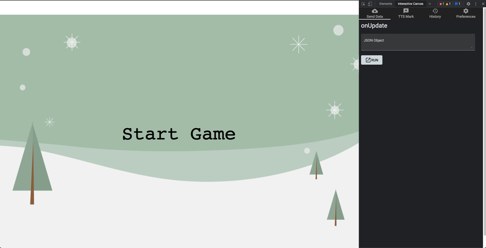
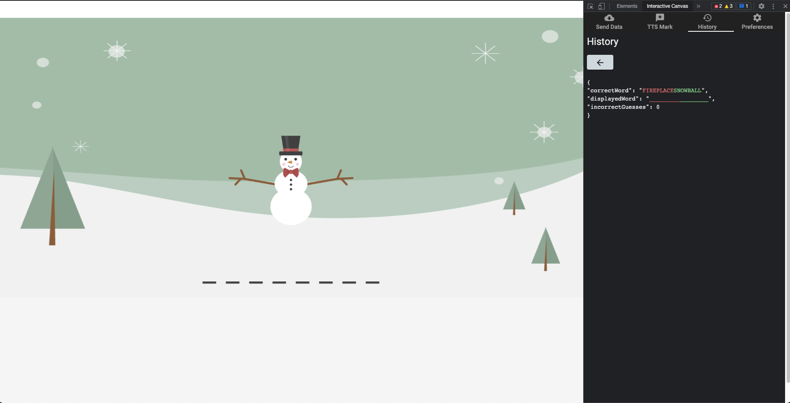

# Interactive Canvas DevTools

Interactive Canvas DevTools is a Chrome DevTools extension for debugging an [Interactive Canvas web app](https://developers.google.com/assistant/interactivecanvas) by allowing for events and commands to be routed through a DevTools tab. This allows development to occur unbundled from a webhook and conversational model and testing everything together.

## Usage

You can install the extension from the
[Chrome Web Store](https://chrome.google.com/webstore/detail/interactive-canvas-devtoo/pkjknimohoicpbkkgdhbdhcgnbcdefhk).

Once installed, you can open your Interactive Canvas project in your web browser, either from a hosted URL or localhost. In Chrome DevTools, find the **Interactive Canvas** tab and select it.

### Sending JSON data and SSML marks

In the **Send Data** tab, you can type in JSON data to manually call the [`onUpdate` callback](https://developers.google.com/assistant/interactivecanvas/reference#onupdate).

In the **TTS Mark** tab, you can type in SSML marks to manually call the [`onTtsMark`  callback](https://developers.google.com/assistant/interactivecanvas/reference#onttsmark).

After sending data from the Chrome extension to the web app, a suggestion chip will appear underneath the textbox to allow you to quickly reenter the same data.

### Viewing Outbound Events

Web app calls to [`sendTextQuery`](https://developers.google.com/assistant/interactivecanvas/reference#sendtextquery) and [`setCanvasState`](https://developers.google.com/assistant/interactivecanvas/reference#setcanvasstate) are routed to the Chrome extension instead of the Google Assistant or your webhook. They are viewable in the **History** tab in reverse-chronological order.

Multiple changes to the canvas state will result in a JSON diff.

### Additional Preferences

There are other preferences that you can enable in the extension to better target their development environment.

* The **Show Header** button will add a header to the webpage that resembles what the header will look like on a smart display. This can let you optimize your layout for that screen size.
* The **Import /SDK** button will let you navigate to and select the project's `sdk` folder if you're using [Actions SDK](https://developers.google.com/assistant/conversational/build/projects?tool=sdk). The extension will then find JSON payloads and TTS marks from your project and make them available as suggestion chips.
* Enabling **Client-side logging** will show messages in your DevTools console.
* Enabling **Extension debug logging** will show messages for development of this tool.
* Methods that [are not supported in Interactive Canvas](https://developers.google.com/assistant/interactivecanvas/web-apps#guidelines_and_restrictions) can be presented as a console warning or throw an error so your local development environment can better resemble a physical device.

## Local Development Setup Instructions

If you would like to compile and test this extension with a local build, follow these instructions:

This project is built using Node.js >=10.18.0 and Angular >=12.

1. Run `npm i` to install dependencies
1. Run `npm run build` to build the extension. It will build the entire project. Alternatively, you can build each part separately.
    1. Run `npm run build:client` to build the code which will be run in the context of the webpage. The Node module artifacts are stored in the `dist/client` directory.
    1. This command also uses Parcel to transpile these artifacts to run in a browser environment. These transpiled artifacts are stored in the `dist/client-bundle` directory.
    1. Run `npm run build:extension` to build the project components that make up the DevTools page. It also will package the artifacts in `dist/client-bundle` and outputs the bundle in the `dist/interactive-canvas-extension` directory.
1. Open Chrome extensions menu: `chrome://extensions/`
1. Enable **Developer Mode**.
1. Select **Load Unpacked**.
1. Select project directory `/path-to-project.../dist/interactive-canvas-extension`.
1. The extension will now be loaded.

### Running Tests

Style is enforced using ESLint. There are also several unit tests on specific
logical functions in this repo. There are not higher-order integration tests
between the various components of the overall architecture.

The `/example` directory contains an SDK project based on the
[public Snowpal sample](https://github.com/actions-on-google/actions-builder-snowpal-nodejs).
This example project is used in several unit tests. It is only used for
development purposes and is not included in the packaged extension.

1. Run `npm run test` to run both ESLint and unit tests. Alternatively, you can run each test separately.
    1. Run `npm run lint` to run ESLint.
    1. Run `npm run fix` to run ESLint and automatically fix style errors.
    1. Run `npm run test:unit` to run unit tests with Ava.

## References & Issues
+ Questions? Go to [StackOverflow](https://stackoverflow.com/questions/tagged/actions-on-google) or [Assistant Developer Community on Reddit](https://www.reddit.com/r/GoogleAssistantDev/).
+ For bugs, please report an issue on Github.
+ Actions on Google [Documentation](https://developers.google.com/assistant)
+ Actions on Google [Codelabs](https://codelabs.developers.google.com/?cat=Assistant).

## Make Contributions
Please read and follow the steps in the [CONTRIBUTING.md](CONTRIBUTING.md).

# License

See [LICENSE](LICENSE).
